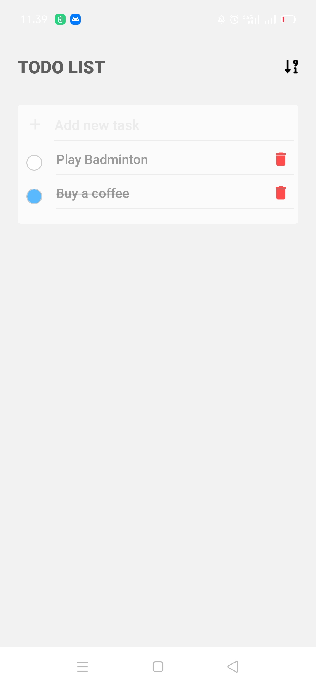
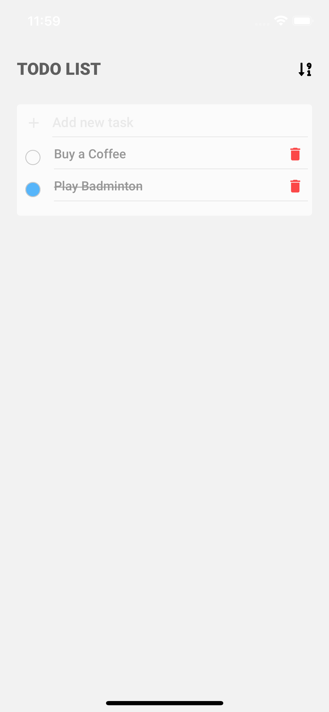

# TODO LIST

## Instalation Problem
you may get error when try to debug in ios. error came from "react-native-vector-icons", please read "react-native-vector-icons" documentation carefully, manual linking maybe need.

Another solution: 
- `yarn react-native link`
- `cd ios, pod install` -> install fonts for ios
- `watchman watch-del-all, rm -rf node_modules, yarn install` (run `rm -rf node_modules, yarn install` maybe exactly not necessary)
- `yarn start --reset-cache`
- `yarn ios`

check this issue https://github.com/oblador/react-native-vector-icons/issues/965#issuecomment-547649424

## Build Result

| Android      | IOS |
| ----------- | ----------- |
|       |         |

another example image, check in this link https://github.com/rachmanzz/react-native-todolist/tree/main/example

- android application: t.ly/7xRe
- ios: - (please run debug from resources)

## Next Plan

- Add Database, maybe I'll use firebase (Cloud Firestore) as database
- Improve functional application
- etc

# Another Project

1. https://github.com/rachmanzz/by.u-clone

